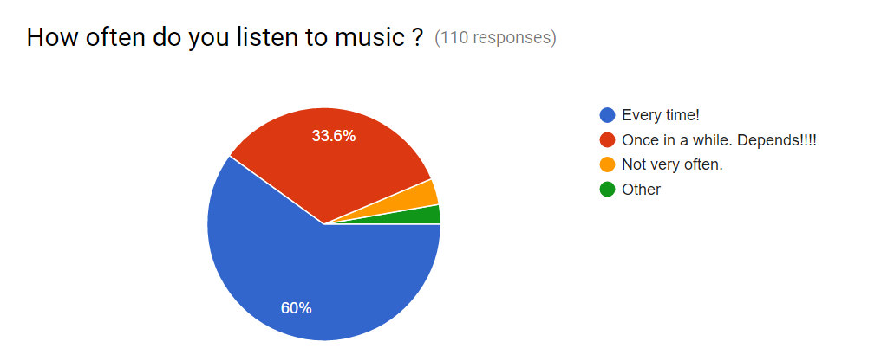
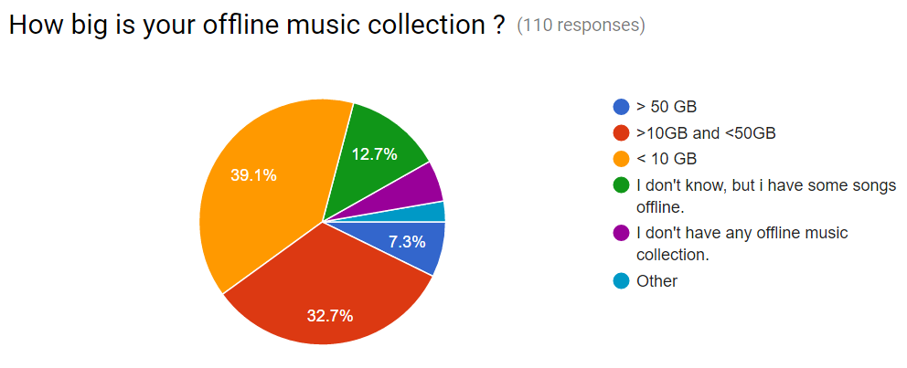
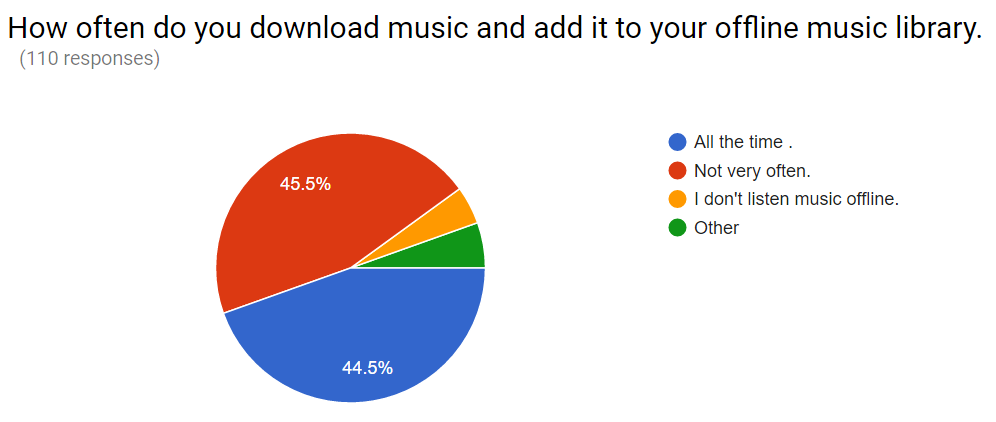
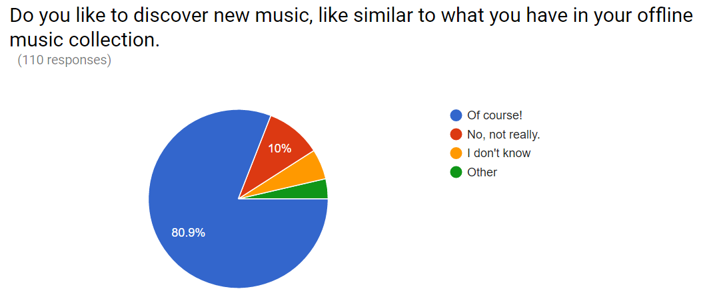
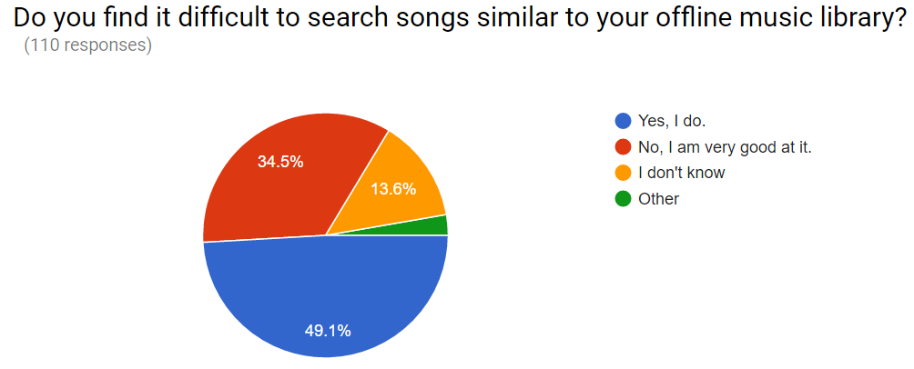
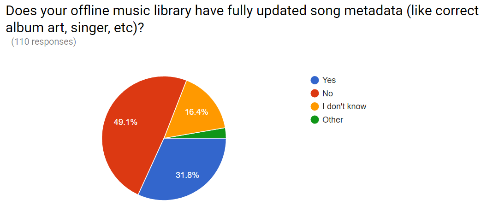
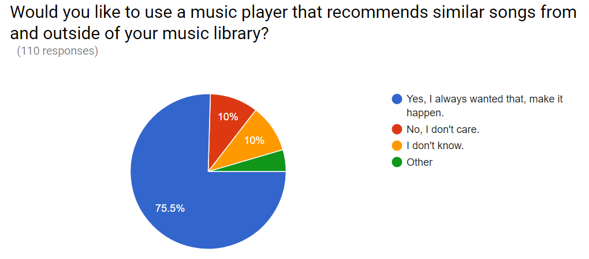

# __Feasibility Study - **Project Recommend**__

A system is considered to be a decent one, if it performs up to the expectations. When we carry out a feasibility study for any software, that is under development, we need to make sure that, our final product is feasible, both economically as well as technically.  

A feasibility study report basically covers the following points:-

*  Analysis of the problem which led to the development of the software.
*  The constraints that developers have to deal with.
*  Results of the surveys carried out to test the feasibility.
*  Checking if our product is economically feasible.

## Analysis of the problem

India currently is a country where the *internet speed* is not up to the mark at many places, with only 2g spectrum, covering most of the regions.
Sometimes, while listening to music, switching to a song of similar taste *manually*, from the user's entire collection of music, does not seem to be a good idea.

The recommendation systems that exist already, do recommend music, but that **has to be played online**, and these require a decent internet speed to play a particular song at decent *bitrate*, which is many a times not possible with 2G data speed. So, our idea is, basically, to *use the offline music collection of a user, to play music.* Of course, 2G network can be used to recommend songs(fetching those from *Musicbrainz* API, in our case), but those songs will be played from the user's local music collection, hence *minimizing the need of using 2G data in order to play music, of good quality*.
Sometimes, it might happen the ID3 tags of a few songs are not updated. One part of our software (*metadata updater*), will update the metadata of those songs whose metadata is either not fully updated or does not exist.
This will replace those systems that are *solely dependent on reliable internet speed, and will provide the benefit of music recommendations to those, who are bound in the regions covered under 2G/GPRS spectrum*.

## Constraints

1. **Waveform Analysis**

This is one of the methods we could have used to classify music. In this method, we analyze and classify the music wave into genres such as pop, jazz etc., but there is not enough training data available to analyze the waveform. Also there is not enough research done in this field. Hence, this method could not be used in practical (For instance, Spotify tried it and got worst of results).

2. **Collaborative Filtering**

Here, in this method, we use user data to recommend next set of songs to the user. But, due to lack of time and resources we do not have enough user data to make this method feasible to use. If we did have the user data, that data would have been used by the training model to recommend new songs based on that data.

3. **Availability of other basic requirements**

Since, internet is one of the basic requirements for our software to work, availability of a reliable data connection is must, does not matter if it is fast or even as slow as 2g. Lack of internet means that our recommender will work like a plain music player, which has little to no use.

Some amount of memory space will always be required to store offline music. This software will give a choice to download those songs after recommending, if those are not already in his offline library, but, since user has little to no space to store the songs offline, he won't be able to download those new songs. Therefore, this software is not suitable for such a user.  

## <u>Conclusions From Our Survey</u>

###### We surveyed 110 odd people, belonging to differnt sectors such as corporate, business etc. and belonging to different age groups.Given below is a list of questions we asked in our survey, and their corresponding responses, represented in the form of pie-charts.  

#### 1.

#### Inference:

This pie-chart shows that most of the people prefer to listen music almost all the time(app. **60%** in our case).

#### 2.

#### Inference:

This pie-chart shows that generally, people at least use a small proportion of their storage memory, for storing music offline(over **32%** people have music collection between *10-50* GBs and app. **39%** people have collection *<10* GBs, that is, the latter have got at least some music offline).

#### 3.

#### Inference:

Nearly half of the people (**45%**), whom we surveyed, download music all the time. This result goes hand in hand with our idea in a sense that, if upon recommendation their collection does not have a particular song, they can download it, at that very instant. A larger part of remaining half(**46%**), do not download music that very often, but still once in a while, they can download.

#### 4.

#### Inference:

This pie-chart shows that a majority of people we surveyed(app. **81%**) prefer to discover music based on their taste(which will be performed by a *classifier* in our case).

#### 5.

#### Inference:

This pie-chart shows that almost half the people(**49%** app.), find it difficult to search the songs similar to the ones they have in their offline music library. This suggests that they would like to get recommendations based on their music taste, automatically, and then accordingly download that particular kind of music.

#### 6.

#### Inference:

This pie-chart shows that almost half of the people do not have a fully updated metadata(app. **50%**), which made us to attach an extra component to our software, known as the *Metadata Updater*.

#### 7.

#### Inference:

Finally, here we ask people, if they want to use such a music player that recommends similar songs from and outside of their offline music library. Seeing the number of people(**76%**) who want this to happen, we concluded that our product is feasible for a majority, and started working for the same.

## Economic Feasibility

Since our project is an open-source one, we do not have any business goals, and are not intended towards earning any profit. The software will be available for all, to download and share.    

----
comments:
Rajdeep: Feasibility study seems okay. it has been well elaborated and suits the needs of the reader regarding the feasibility of the project.
Complete with the survey reports as well 
