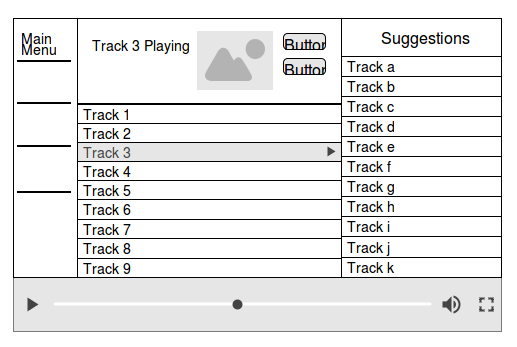
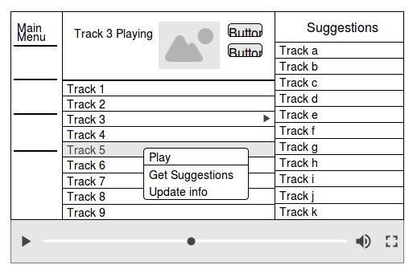

  <h1>Software Requirements Specification</h1>
  <h2>Project Recommend</h2>
  <b> Music Recommendation System </b> 
  <b> Version <i>alpha</i></b>

  

Prepared by Raghav Mittal  
NIIT University  
12-Sep-2016  

 

# Table of contents
1. [Introduction](#introduction)  
1.1 [Purpose](#introduction-purpose)  
1.2 [Document Conventions](#introduction-dc)  
1.3 [Intended Audience and Reading Suggestions](#introduction-iars)   
1.4 [Product Scope](#introduction-product-scope)  
1.5 [References](#introduction-references)  
1.6 [Terminology](#introduction-terminology)
2. [Overall Description](#od)  
2.1 [Product Perspective](#od-pp)  
2.2 [Product Functions](#od-pf)  
2.3 [User Classes and Characteristics](#od-ucc)  
2.4 [Operating System](#od-os)  
2.5 [Design and Implementation Constraints](#od-di)  
3. [External Interface Requirements](#eir)  
3.1 [User Interfaces](#eir-ui)  
3.2 [Hardware Interfaces](#eir-hi)  
3.3 [Software Interfaces](#eir-si)  
3.4 [Communications Interfaces](#eir-ci)  
4. [System Features](#sf)  
5. [Other Nonfunctional Requirements](#onr)

  

# 1. Introduction 
## 1.1 Purpose 
The purpose of this document is to provide a debriefed view of requirements and specifications of the project called “Music Recommendation System“, v1.0. This document discusses about whole system from backend to user interactions. It will give both high level and low level abstract view of the system.

## 1.2 Document Conventions 
* All terms are in italics style.
* Main features or important terms are in bold style.

## 1.3 Intended Audience and Reading Suggestions 
* Anyone with some basic knowledge of programming can understand this document. The document is intended to developers.
* It is divided into 5 phases with sections 3, 4, 5 being intended for developers and software managers but other sections can be understood by anyone having little knowledge about softwares.

## 1.4 Product Scope 
* Name of the project is "Music Recommendation System". It is a Desktop App.
* Plays music and provides suggestions based on song which user is listening to from both offline library which is available in user's machine as well as on internet.
* Advantages:
 * it provides suggestions from local music library.
 * Works with slower internet connection because it needs less bandwidth for providing recommendations.
* It uses [MusicBrainz][musicbrainz-website] database for getting metadata of all the music present in user's local library and recommend songs.
* Most of the recommendations systems are either paid or require to process lots of user data in order to give suggestions which are only available while internet is working.
* Music recommendation system can also work offline because it utilizes tag information to give suggestions.
* There are no specific audience for this software. Anyone can install it and use it.

## 1.5 References 
* This document is written in Markdown.
* IEEE. IEEE Std 830-1998 IEEE Recommended Practice for Software Requirements Specifications. IEEE Computer Society, 1998.

## 1.6 Terminology 
| Term | Description |
| --- | --- |
| User | Any living being who is interacting with the software is a _user_.|
| System | The package of all the components which takes input and gives output to demonstrate the features of the software is called System. |
| Database | Collection of information on different topics related to each other. |
| Library| The collection of songs inside a directory or across multiple directories forms up a _library_.|
| Store | This is the persistence layer of whole system. |
| Metadata | The set of data which describes and gives information about the sound track. |
| Recommender system | A system which takes a song as input and outputs set of songs closely related to the input. |
| Classifier| An algorithm that implements classification, especially in a concrete implementation. It is the part of _recommender system_. |
| Tags | A label attached to song which gives extra information about it. |

----
> **comments**:  
Rajdeep: Complete with Terminology, this is a ne feature i just came to notice and liked it. Terminology it seems is there as an integral part of most of the professional srs documents.

# 2. Overall Description 

## 2.1 Product Perspective 
This system consists of three components packaged as one desktop application:
* **Music player**: for playing music from local library.
* **Classifier**: On the bases of present song playing, Classifier will generate suggestions.
* **Metadata updater**: It update all the songs in library with their metadata tags. This is done using already available online database like "[MusicBrainz][musicbrainz-website]".
* **Local database**: It is a MySQL Lite database which acts as a map between song titles, paths and keeps a check on each songs for its metadata information.

With _music player_ user can play/pause/stop/forward/rewind song tracks. It is fully functional music player like any other player present in public domain.
When music is played, it sends the present track metadata to classifier.  

_Classifier_ needs some song title and metadata as input to generate suggestions. On the bases of
input song it suggests similar songs which may be already available in local library else will be linked to online domains.

_Metadata updater_ is very similar to MusicBrainz's [Picards][picards-website] software. It takes a sound track or list of sound tracks as input and update their metadata information according to information available in [MusicBrainz database][musicbrainz-database-website]. This component needs internet for functioning.

_Local database_ maintains a list of tracks along their path in system which user wants to listen and mark them as updated and not updated on the bases of their synchronization with MusicBrainz database. This helps system to keep all the tracks updated and minimizes the need of updating whole user library at once which can slow down the system.

----
> **comments**:  
Rajdeep: The product perspective should also contain a component diagram to further elaborate the components used in the project.

## 2.2 Product Functions 
Using this app, user can play songs available in offline library. While playing music user can get a list of suggested songs which are most closely related with the present song in terms of their metadata tags like singer, genre, release year, rating etc. These songs may be present in offline library or online sources.

User can perform following actions:
* play/pause/forward/rewind/seek/stop > music controls
* add songs/ remove songs
* update metadata
* get recommendation

## 2.3 User Classes and Characteristics 
All types users can use this software. This software is focused to interest the users who like to explore songs from similar mood or genre while listening to their playlist.
It will cater the needs of those users who have low internet speeds and limits but are interested in exploring similar yet diverse music that is similar in terms of genre and mood but may be of different languages and from different countries.

Also this software don't leak private data to any external server. Neither it spies on users' content like other applications, nor it tracks users' beheaviour like it is done in [collaborative filtering][collaborative_filtering_wikipedia]

## 2.4 Operating System 
Linux(Ubuntu, Fedora, Mint etc.), Windows 7 and up.

## 2.5 Design and Implementation Constraints 
For recommendation of music we are using metadata available in individual tracks which is an Implementation of [_**content based filtering**_][content_based_filtering_wikipedia].  

We could have implemented [_collaborative filtering_][collaborative_filtering_wikipedia] for generating suggestions which is more accurate then metadata approach but because we are not storing user data we cannot implement that.  

In [_content based filtering_][content_based_filtering_wikipedia], songs are grouped into different views on bases of their metadata(properties like genre, singer, mood etc) which is already available. Unlike _collaborative analysis_, user behaviour is not analyzed here and this may lead to less accurate results. Also this method needs a standard metadata schema over all the tracks that is the reason we are using [_MusicBrainz database_][musicbrainz-database-website] here.  

The other way is [_waveform analysis_](http://www.academia.edu/4631247/Waveform-Based_Musical_Genre_Classification). In this method sound tracks are analysed and grouped into different genres according to their waveform but it was found that this method is inaccurate. This technique is under research and development and is not proven successful.

## 2.6 User Documentation 
* There is a user manual that lists all the features available for the user and methods to access them.
* "Help" option will be available in user interface which will redirect to Project Recommand [website][project-recommend-website].

## 2.7 Assumptions and Dependencies 
There are no assumptions and dependencies.

----
> **comments**:  
Rajdeep: if not assumptions there are definitely dependencies in the project. Especially with regard to the various open source resources we will be using, their libraries and in some cases their codes.

# 3. External Interface Requirements 
## 3.1 User Interfaces 
User interface is implemented in QtPy that is a python library. There is one front page which interacts with user. It is divided into frames for different functions.  

Below are the wireframes for proposed UI. The final UI may vary from the one below.

## 3.2 Hardware Interfaces 
* Input device is needed for user to interact with system.
* Software needs a display device to interact with user.
* Music player needs playback device for sound output.
* Working Network Interface Card(NIC) for internet connectivity

## 3.3 Software Interfaces 
TBD

## 3.4 Communications Interfaces 
The Internet connection is used for communication between [_Metadata updater_](#od-pp) and [_MusicBrainz Database_][musicbrainz-database-website].  
All network communication follows HTTPS/TLS protocol.

----
> **comments**:  
Rajdeep: the software interfaces will be decided later, so a good call in leaving it blank for the time being.

# 4. System Features 
Below is the **Actor-Role table** to give a glimpse of all the possible use-cases.

| ID | Actor  | Roles  | Description|
| --- | --- | --- | --- |
| **UC_1** |  User | Play music |Fetches track path from database, get data from user system and plays it.|
| **UC_2** | | Pause Music | Pause current track. |
| **UC_3** | | Seek | Seek to different locations inside the song track through a timeline.|
| **UC_4** ||Next track|Play track next to the presently playing track in the list.|
| **UC_5** ||Previous track|Play track previous to the presently playing track in the list. |
| **UC_6** | |Stop music|Stops the track.|
| **UC_7** || Remove track|Removes the track from playlist and hence from database.|
| **UC_8** ||Add new track|Adds new track to playlist and hence to database.|
| **UC_9** || Volume  Up| Increase sound volume relative to system volume.|
| **UC_10** || Volume Down| Decrease sound volume relative to system volume.|
| **UC_11** || Update Metadata | Manually update metadata for selected track. |
| **UC_12** || Get suggestions | Manually get suggestions for a selected track. |

## Music Player
Using this feature user can
* Play music
* Pause music
* Stop music
* Go to previous track
* Go to next track
* Seek
* Decrease Volume
* Increase Volume

## Song recommender
It suggests songs similar to the song presently playing in the player. Suggested songs can be from user library or MusicBrainz Database

## Library tag updater
This feature is similar to [Picards][picards-website].
* Updates metadata tag information of a song.
* Synchs information with [Musicbrainz Database][musicbrainz-database-website].

----
> **comments**:  
Rajdeep: System features should have been augmented with a use case diagram to enhance its usefulness and show how the user is interacting with the system. It is also not clear how the user will interact with the system in order to get his job done and what are the direct and indirect user interactions that the user does.

> Surajnath: Overall study is good but you must have added use case diagrams it. I know you have very less time left. But should add it in upcoming versions.

# 5. Other Nonfunctional Requirements 
* System must be robust enough to handle huge music collection.
* UI must be very elegent and simple.
* UI must be adaptable to different size of screens.
* There should be diferent warnings to avoid uncomfortable conditions for the user. These may be
  * warning message if user listens to very high volumes.
  * warning should be generated if user tries to play a song with wrong or unsupported format.
* Software Documentation should be very well organized. It must contain each and every detail but should be written precisely in less words.

<!--# 6. Other Requirements -->

<!--# Appendix -->

- Source for outline of this SRS Document : [Wikipedia](https://en.wikipedia.org/wiki/Software_requirements_specification#Structure)

----
> **comments**:  
Rajdeep: Overall good job done.  

> Saumya: The document is nicely written.

> Pranshu: Overall it is good. Add use case and component diagrams in upcoming versions.

[musicbrainz-website]: https://musicbrainz.org
[musicbrainz-database-website]: https://musicbrainz.org/doc/MusicBrainz_Database
[picards-website]: https://picard.musicbrainz.org
[collaborative_filtering_wikipedia]: https://en.wikipedia.org/wiki/Collaborative_filtering
[content_based_filtering_wikipedia]:https://en.wikipedia.org/wiki/Recommender_system#Content-based_filtering
[project-recommend-website]: https://projectrecommend.github.io/
