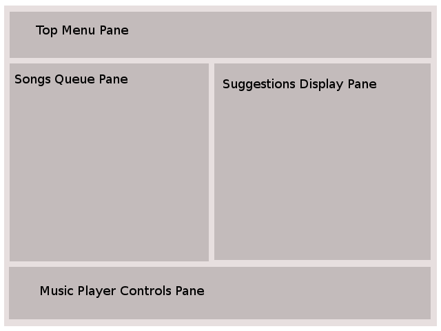

  <h1>Software Design Document</h1>
  <h2>Project Recommend</h2>
  <b> Music Recommendation System </b> 
  <b> Version <i>1.0</i></b>

  

#### Team Project Recommend

- **Surajnath Sidh**  U101114FCS146
- **Rajdeep Mukherjee**  U101114FCS115
- **Raghav Mittal**  U101114FCS111
- **Pranshu Sahijwani**  U101114FCS104
- **S. Shakthi**  U101114FCS196
- **Saumya Gupta**  U101114FCS126

#### NIIT University
##### 26-Oct-2016

 

----------------------

## Change Log

| Version  | Date | Description |
|----------|------|-------------|
| 1.0 | 28-Oct-2016 | initial version of document, Based on IEEE 1016-Software Design Document guidelines   |

---------------------------------

# Table of contents
[1. Introduction](#introduction)  
   [1.1 Purpose of this document](#potd)
   [1.2 Scope of the development project](#sotdp)  
   [1.3 Definitions, acronyms, and abbreviations](#daaa)  
   [1.4 References](#ref)  
   [1.5 Overview of document](#ood)  
[2. System architecture description](#sad)  
   [2.1 Overview of modules / components](#oomc)  
   [2.2 Structure and relationships](#sar)  
   [2.3 User interface issues](#uii)  
[3. Detailed description of components](#ddoc)  
   [3.1 Component template description](#com_td)  
   [3.2 Component: MusicPlayer](#com_mp)  
   [3.3 Component: LocalStorage](#com_ls)   
   [3.4 Component: MetaData](#com_md)  
   [3.5 Component: Classifier](#com_c) 
[4.0 Reuse and relationships to other products](#rartop)  
[5.0 Design decisions and tradeoffs](#ddat)  
[6.0 Pseudocode for components](#pfc)  
[7.0 Appendices (if any)](#appendices)  
SDS component template  

---------------------------------

# 1. Introduction 

## 1.1 Purpose 
The purpose of this document is to describe the implementation of the *Project Recommend ( Music Recommendation Software )* whose
requirements have been described in detail in the SRS document submitted before.

The *Music Recommendation Software* as specified earlier, is a music player software that not only plays music but also
suggests music based on what the user is listening to, from the user's offline collection as well as online collection, which
requires Internet connection. During recommendation if required it will update metadata of the song.

The sections in this document will provide guidelines related to the structure and the design of the project and will contain the following too.

**Component Diagram** : information about the external and internal components of the system.

**Class Diagram** : specific information about the expected input, output, classes, and functions. The interaction between the
classes to meet the desired requirements.

**Sequence Diagram** : specific information about how objects operate with one another and in what order.

## 1.2 Development Project Scope 

- Name of the project is "Project Recommend". It is a Desktop App.

- Offline music recommendation is an area of application development that is yet to be fully explored as there has not been
enough attempts to develop a software to fulfill this need. Browsing over the Internet, one may get enough music recommenders
online but that is the real catch here, they are mostly **_online_**. Here, our development team is trying to build an **_offline_** music
recommender application to fulfill users need of getting music suggestions based on their already present music collection.

- Offline Music recommendation plays music and involves recommendation of familiar tracks and familiar genres of music available both on
the Internet and from offline library which is available inn user's machine.

##### Advantages

- It provides suggestions from local music library.
- Works with slower Internet connection because it needs less bandwidth for providing recommendations.
- It uses [MusicBrainz](https://musicbrainz.org/) database for getting metadata of all the music present in user's local
library and recommend tracks.
- it is not platform or service specific.
- it is not bounded with any music provider services so it is suggestions are not limited to particular service.
- There are no specific audience for this software. Anyone can install it and use it.
- This software is open source which means anyone can contribute and suggest changes and features to the project.

## 1.3 Definitions, acronyms, and abbreviations 

- TBD means "To be Decided", these are the components that are not yet decided.
- ** More abbreviations are to be written here, after the doc  completion**.
- Terminology definitions are given in the following table.

| Term | Description |
| --- | --- |
| User | Any living being who is interacting with the software is a _user_.|
| System | The package of all the components which takes input and gives output to demonstrate the features of the software is called System. |
| LocalStorage | This is the persistence layer of whole system. |
| Metadata | The set of data which describes and gives information about the sound track. |
| Recommender system | A system which takes a track as input and outputs set of tracks closely related to the input. |
| Classifier| An algorithm that implements classification, especially in a concrete implementation. It is the part of _recommender system_. |
| Cache | A software component in the system that preserves data for a defined life. |

## 1.4 References 

- This document is written in github flavored Markdown.

- IEEE. IEEE Standard 1016 IEEE Recommended Practice for Software Design Specifications. IEEE Computer Society, 1998.

- Sample Software Design document for TheraWii, a software at [www.cs.drexel.edu](https://www.cs.drexel.edu/~dpn52/Therawii/design.pdf "Sample1").

- Sample Software Design document for a one runway airport, an air traffic controller simulation at [www.rivier.edu](https://www.rivier.edu/faculty/vriabov/CS552_SW_Design_Specification_Example.pdf "Sample2").

- - Sample Software Design document for [*ProjectTracker* - cs.utah.edu](https://www.cs.utah.edu/~jamesj/ayb2005/docs/SDS_v2.htm#Table_of_Contents)

## 1.5 Overview 

- This document is divided into sections 2, 3, 4, 5, 6 and 7 with intended readers being, the developers
and software managers but sections have been written in a manner that it can be understood by anyone having
little knowledge about software.

This *Software Design Specification* also includes:

- System architecture description.
- Detailed description of components. ( including the template description for each component)
- Reuse and relationships to other products.
- Design decisions and tradeoffs.

The design has been made clear, using the class diagram and sequence diagram.

# 2. System architecture description 

Project Recommend (Our Software/System) is strictly based on modular architecture, there are four modules
in system that are functionally connected to each other as per Functional Cohesion paradigm and these components
are Coupled as per Data coupling.

## Coupling and Cohesion of System

#### Data Coupling

As per Definition one System have Data Coupling when *modules share data through, for example, parameters. Each datum is
an elementary piece, and these are the only data shared (e.g., passing an integer to a function that computes a square root)*

From Sequence Diagram[TODO - add link] we can see that System passes Data around hence system have Data Coupling.

#### Functional Cohesion

TODO - add links to components diagram

As per definition one system is in Functional Cohesion  *when parts of a module are grouped because they all contribute
to a single well-defined task of the module* as we can see that in our system each module contains classes that all
contribute in a single Task.

## 2.1 Overview of modules / components 

The structure of our project is highly modularized. We have tried introducing as much functional cohesion as possible.
For coupling we have tried to achieve data coupling.

System contains four modules that are mentioned below

- **Music Player**
  Music Player module handles functionality related to playing and handling music

- **Local Storage**
  Local Storage module functions as a Persistence Layer (Storage) of system.

- **Meta Data**
  Meta Data module handles all functionality related to Meta Data (ID3 Tags)

- **Classifier**
  Classifier handles all functionality related to Recommendation of songs for a songs

## 2.2 Structure and relationships 

System is following modular Structure, see Component Diagram of system.
This Section also includes Class Diagram and Sequence Diagram of System, That shows Structure and relationships in between
components in our System.

## Component diagram of System

[add Component diagrams here ]

## Class diagram of System

[add Class diagram]

## Sequence diagram of System

** you are advised to see Sequence Diagram here in full resolution**

[add link to Sequence diagram in full resolutions]

[add Sequence diagram]

### process / flow of Control / fow of data

#### startup(Initialization) process

- On first start when application is first started it Triggers spacial Initialization process *OnFirstStartup*
which involves building LocalStorage. We store songs data on LocalStorage, after that process finises
it Triggers *onEachStartup* that does rest of startup work for application.

- if it's not a first time startup on that Computer then it triggers onStartupProcess that does the basic application
startup work, like connecting to LocalStorage then query data from LocalStorage so we can Show the list of songs that user
added in application, after application finises startup and we populate songs data on MusicPlayer
it triggers invalidateCache that removes all the entries of Recommended songs that are invalid (older then defined life of cache)

 Now we have a list of songs populated in MusicPlayer, now user can Take any actions like *add a new song*,
*remove song*, *play*, *Pause*, *stop*, *next song*, *previous song*, *change volume*, *seek*,
*Edit MetaData*, *Manually get recommendation*, *Reset all*.
below we describes these actions and how they functionality and internally works, with the help of Class Diagram and Sequence Diagram.

#### based  on user actions

- **Play** - Play takes *SongID* from selected song in UI and Goes to *LocalStorage*, fetches data including
absolute path to Music file. it also goes to *ReadMetaData* and Reads the MetaData for that Same SongID, after both returns
we play the song.

    - For recommendation we *ReadCache* for that song, if we have a Cache hit, we will populate the
Recommend song list.
    - If there is a Cache miss we *FetchRelevantSong* based on metadata of given song.
    - if we find that MetaData of song is not updated then we *FetchMetaDataFromMusicBrainz* and
    Update the metadata and Continue with process.
    - After MetaData Check/Update and after fetching *RelevantSongs*, we will run our pre-trained Classifier (*Predict* function)
    to recommend songs.
    - we will take that result and Write it to Cache with *WriteCache* and return that data back to
    Play call to populate Recommend song list.

- **Pause** - if a song is currently playing it pauses that song on that position.
    - It waits for the response from the **controlMusic** function of the **music palyer** module. Its return type is *boolean* and will return *true* if *pause* action is successful.

- **Stop** - If a song is currently playing then it will stop it and set the position to start.
if a song is already paused then it will set it's position in start.
    - Similar to the *pause* action. Waits for an asynchronous response from the *controlMusic* function. Return type is also *boolean*, that is, returns *true* if a track is stopped successfully.

- **next song** - it will take the SongID of currently playing Song and Calls the *Play* with SongID of song
that is next song of playing song in UI

    - As soon as the user requests the *next song*, *nextSong* will be invoked at first, and the *play* method will be called internally, which will take the *song ID* of the current song as its argument, and will pick up the song that is next to the current one(**Note** - If *shuffle* is enabled, it will randomly pick up any song from the entire playlist.). *play* method will also return a boolean, but that will be used for internal decisions, **only**. Final response will contain only the output of *nextSong* method.
    - Since the *play* method is getting invoked here, all the actions associated with it will get executed too, as described in the *play* section.
    - Finally, if the next song is played successfully, the *nextSong* function will return *true*, as its return type is also *boolean*.

- **previous song** - It will take the Song ID of currently playing Song and Calls the *Play* with Song ID of song
that is previous song of playing song in UI

    - Same as the **nextSong**, the only difference being that, depending on the current song id, it will fetch the previous song in the playlist.

- **Seek** - This will use a horizontal *slider* to change the position of current track, where the unit is a *second*. The method will return *true*, on success, and *false* otherwise.

- **Volume Control** - This will use a vertical slider, to change the volume to desired *integer* value. Also, will return *true* on a successful volume change.

- **Add Song** - This will pass the song *path* as an argument to the *add* method. This method in turn invokes *write* method of *AccessLocalStorage* class, and passes the same path as an argument, and after successfully writing that very song to the local storage, returns *true* to *add* method, which also returns *true* as a status, to the user.

- **Remove Song** -  This will pass the song *path* as an argument to the *remove* method. This method in turn invokes *delete* method of *AccessLocalStorage* class, and passes the same path as an argument. Here, another method called *manageCache* of *Classifier* module gets invoked, to clear the cache of that particular song, which, if successful returns *true* to the *delete* method which returns *true* to *remove* method, which also returns *true* as a status, to the user, if every small target is achieved.

- **Get Manual Recommendation** - This will call the *readCache* method of *manage cache* class, and will pass the *Song ID* as the argument. If the cache is empty, it will call the *fetchRelevantSong* method of *GetRecommendation* class, which returns a *dictionary*, another method called as *predict* gets invoked which takes in the song id and dictionary returned as its arguments, and returns a set of predicted songs as another dictionary, which is passed as an argument to the *writeCache* method, and this fills the cache which was empty earlier, and returns a response *true* on success. The Predicted songs are used to populate the recommended songs view. After all this is done, a response of *true* is sent to the user.

- **Edit Metadata** - This will call the *editMetadata* method of *manage metadata* class, and passed the song ID as an argument. This will internally call the method *setIsUpdated*, and will return true on successful operation. If, every thing goes right, *editMetadata* returns *true* as a response to the user.   

- **Reset-All** - This will invoke two functions, *dump* and *build* of *manageLocalStorage* class, first one will destroy the entire SQL database of local storage, and latter will rebuild and give an empty database. Both, these functions return a response of *true*, which is then forwarded to the user. One more function is invoked, *dumpCache*, of *manage cache* class, which clears the entire cache. This is also called at the same time as the above two functions.

## 2.3 User interface issues 

The UI is devided into 4 parts. These are
- **Top Menu Pane**
- **Songs Queue Pane**
- **Music Player Controls Pane**
- **Suggestions Display Pane**

 

**Top Menu Pane** contains the following options  
- *File*
  - Open Music Directory: On click it presents a *directory selection window* to user for selecting directory from local machine to load tracks into Songs Queue Pane.
  - Add Song: On click it present a *file selection window* to user for selecting a song track from local machine.
  - Reset All: On click it triggers the functions to clean the local storage of application by removing all the entries from local database.
  - Exit: On click the application is closed.
- *Metadata*
  - Update Metadata for Directory: On click it triggers the functions for updation of metadata of all the tracks present in Songs queue.
- *Help*
  - Documentation: On click browser is called and the Github page of Project Recommend is loaded. The aim of this link is to help developers to understand the software in detail.
  - About: On click it presents a new windows giving a brief overview about the project and name list of contributors.

Inside **Songs Queue Pane** a list of song tracks which are loaded from user defined directory is displayed.  

**Suggestions Display Pane**: A list of all suggested songs based on the presently playing track is shown here. It includes songs available on local machine as well as those which are unavailable in local machine.  

- *Available songs*: Can be loaded directly on music player from suggestions section.  
- *Unavailable songs*: Can't be played directly but clicking of each such track will lead to opening of Internet browser and Google search results will be displayed corresponding to that track.  

**Music Player Controls Pane** includes the following controls: *Play Music, Pause Music, Stop Music, Next Track, Previous Track, Seek Bar*.
-------------------------------------------------------

## 3. Detailed description of components 

## 3.1 Component template description 

we are discussing components in below mentioned manner

### Component : Name of Component

Description of Component

#### Class : Class X

Description of Class X

Description of class X functions in tabular form

| Function | input | output | Description |
| --- | --- | --- | --- |
| prototype | input parameters | return values and their types | description of function |

#### Class : Class Y

Description of Class Y

Description of class Y functions in tabular form

| Function | input | output | Description |
| --- | --- | --- | --- |
| prototype | input parameters | return values and their types | description of function |

-------------

Our components are:

### 3.2 Component: MusicPlayer 

Description: This component as a whole handles functionality related to playing music and controlling music.
Music Player functions are well defined by the methods that we have used in the corresponding classes.

#### Class: ManageSongs

Description: Adds, Removes and queries songs from LocalStorage.

| function | input | output | description |
|----------|-------|--------|-------------|
| +add(SongPath:string):boolean | SongPath:absolute path to the music file | Status:Success or failure | adds song to Local Storage |
| +remove(SongId:int):boolean   | SongId: id of the corresponding music file from Local Storage | Status:Success or failure | Removes song from Local Storage |
| +query():Dict | void | Dict: Dictionary containing key value pairs of all songs from Local Storage | Reads all entries from Local Storage and returns them in custom dictionary. |
| +ResetAll():boolean | void | Status:Success or failure | Dumps and rebuilds LocalStorage, Dumps Cache |
| +ManuallyGetRecommendation(SongID:Int):Dict | SongID: id of the corresponding music file from Local Storage | Dict: Dictionary containing key value pairs of data of predicted(Recommended) Songs of the Song.| Checks Cache for results if not present triggers ifCacheIsEmpty alt Condition |

#### Class: ControlMusic

Description: Controlling of Music.

| function | input | output | description |
|----------|-------|--------|-------------|
| +Play(SongID:int):boolean | SongID: id of the corresponding music file from Local Storage | Status:Success or failure | fetches absolute path to song file from Local Storage and plays music file |
| +Pause():boolean  | void | Status:Success or failure | Pause the currently playing music if its playing |
| +next(SongID:int):boolean | SongID: id of the corresponding music file from Local Storage | Status:Success or failure | play the next song. |
| +prev(SongID:int):boolean | SongID: id of the corresponding music file from Local Storage | Status:Success or failure | play the previous song. |
| +seek(minute:int, second:int): boolean | minute: target minute to seek second: target second to seek   | Status:Success or failure | Seeks currently playing song to required minute and second. |
| +Stop():boolean  | void | Status:Success or failure | Stops the currently playing song if it is playing |
| +volControl(TargetVol: int):boolean | TargetVol: the target volume that must be changed is entered  | Status:Success or failure | Controls the volume |

### 3.3 Component: LocalStorage 

Description: This is the persistence layer of the system. It holds data related to songs.

#### Class: AccessLocalStorage

Description: Helper functions to access LocalStorage.

| function | input | output | description |
|----------|-------|--------|-------------|
| +Read(SongID: int):Dict | SongID: id of the corresponding music file from Local Storage | Dict: Dictionary containing key value pairs of song data of given SongID from Local Storage | Reads entry of given SongID from Local Storage and returns it in custom dictionary. |
| +Write(SongPath: String):boolean | SongPath:absolute path to the music file | Status:Success or failure | Creates a new entry for music file in LocalStorage if it's  not in LocalStorage |
| +Update(SongID:int):boolean | SongID: id of the corresponding music file from Local Storage | Status:Success or failure | Updates entry of given SongID in Local Storage |
| +Delete(SongID:int):boolean | SongID: id of the corresponding music file from Local Storage | Status:Success or failure | Deletes entry of given SongID from Local Storage |

#### Class: ManageLocalStorage

Description: Functions related to overall maintenance of the LocalStorage.

| function | input | output | description |
|----------|-------|--------|-------------|
| +Build():boolean | void | returns true if the LocalStorage is successfully built. | This function builds the database on first start up that is when the software is launched for the first time after installation |
| +Dump():boolean | void | returns true if successful in dumping the instance of LocalStorage and false otherwise | This function dumps the instance of the LocalStorage in case of un-installation of the software |
| +Connect():boolean | void | returns true if successful in connecting to the LocalStorage | Connects to the instance of the LocalStorage. This is done for each subsequent startup or launch of the application. |
| +Disconnect():boolean | void | returns true if successful in disconnecting from the LocalStorage | Disconnects from the LocalStorage. This is done for each closing of the application |
| +getIsConnected():boolean | void | returns the value of global variable isConnected.   | getter function for the isConnected global variable. Once connection is established isConnected variable is set. On disconnection isConnected variable is cleared  |
| +setIsConnected(isConnected):void | isConnected variable is set | void | setter function for the isConnected global variable. Once connection is established isConnected variable is set. On disconnection isConnected variable is cleared. |

### 3.4 Component: MetaData 

Description: This module handles metadata Manipulation and updation in the system, It is also responsible for
fetching metadata from external sources like MusicBrainz.

#### Class: ManageMetaData

Description: Helper functions related to metadata handling.

| function | input | output | description |
|----------|-------|--------|-------------|
| +ReadMetaData(SongID:int):Dict | SongID: an integer that defines the unique ID of the song  in the LocalStorage  | Dict: a dictionary containing the key value pairs of metadata that is returned from the song | Fetches path of the song from LocalStorage based on the ID and fetches the song metadata from the file |
| +WriteMetaData(SongID:int):boolean | SongID:an integer that defines the unique ID of the song in the LocalStorage    | returns true if method could successfully write into the music file, false otherwise | Fetches path of the song from the LocalStorage based on the songID and writes metadata into that song  |
| +FetchMetaDataFromMusicBrainz(SongID:int):boolean | SongID:an integer that defines the unique ID of the song in the LocalStorage    | returns true if method could successfully write into the music file, false otherwise | it fetches metadata form a song from MusicBrainz service |
| +EditMetaData(SongID:int):boolean | SongID: the unique id of the song in the LocalStorage | returns true for success and false for failure | updates song metadata. |
| +getIsUpdated():int | void | returns the value of IsUpdated variable | getter function for IsUpdated function  |
| +setIsUpdated(isUpdated) | isUpdated variable | void | sets the global variable IsUpdated |

### 3.5 Component: Classifier 

Description: This component is the core of the system. It handles the part of recommendation of new songs based on a given song.

#### Class: GetRecommendation

Description: This class contains functions for fetching relevant songs of a song and predicting(recommending) new songs that user might like.

| function | input | output | description |
|----------|-------|--------|-------------|
| +FetchRelevantSong(SongID:int):Dict | SongID: id of the corresponding music file from Local Storage | Dict: Dictionary containing key value pairs of data of relevant Songs of the Song. | Reads data of given songID and Triggers MetaData Updation if MetaData of Given Song is not Updated. if Metadata is already updated, it reads that metadata otherwise waits for MetaData Updation to complete and then Reads it.After reading of metadata it Fetches relevant songs from that metadata from MusicBrainz Database and returns them in Custom Dictionary  |
| +Predict(SongID: int, RelevantSongDict: Dict) : Dict | SongID: id of the corresponding music file from Local Storage.RelevantSongDict: Custom Dictionary of Relevent Songs Returned by *FetchRelevantSong* | Dict: Dictionary containing key value pairs of data of predicted(Recommended) Songs of the Song. | Takes the Result of *FetchRelevantSong* and returns the recommended song, this is the step that uses our trained Classifier to recommend Songs |

#### Class: ManageCache

Description: This class manages Cache of songs that are suggested by the GetRecommendation class.  

| function | input | output | description |
|----------|-------|--------|-------------|
| +ReadCache(SongID:int): Dict | SongID: id of the corresponding music file from Local Storage | Dict : Custom dictionary of recommended songs of given SongID from cache | Reads cache for Recommended songs of a given song and if these is a cache miss it will trigger the *GetRecommendation* to get recommendation, if it triggered *GetRecommendation* then when *GetRecommendation* will write result to cache it will tries again and gets result from Cache. |
| +WriteCache(PredictedSongDict:Dict) : boolean  | PredictedSongDict : Dictionary of Predicted (Recommended) Songs that is returned by *Predict* function. | Status:Success or failure | It Takes Dictionary of Predicted (Recommended) Songs that is returned by *Predict* function and Writes that into Cache. |
| +invalidateCache():boolean | Void | Status:Success or failure | It gets triggered on each startup,it removes entries from Cache that are older then our pre-defined cache lifetime |
| +dumpCache():boolean | Void | Status:Success or failure | It removes all entries from cache. |
| +DeleteCache(SongID:int):boolean | SongID: integer that uniquely identifies the song in the LocalStorage | Status:Success or failure | Deletes specific songs from the cache. |

---------------------------------

# 4.0 Reuse and relationships to their products 
-------- TODO - Not Applicable Section--------

If a project is doing some enhancement work, it requires to look into reuse issues. This project is using the existing concept of a basic music player, which plays music, with the usual user requirements of playing previous, next songs, adding and removing songs, and volume control. In addition to that, the software will recommend music too, based on what the user is listening. We already have many tools doing that, such as Pandora, Spotify, SoundCloud etc. But these applications suggest music from their existing online libraries, demand an account to be created and also an Internet connection.

So, the enhancement this project offers to the user is recommendation from the user's offline collection. This obviously, requires Internet connection, if the recommendations are not cached. But once cached, it recommends music even when the user is offline.

# 5.0 Design decisions and tradeoffs 

Our Team is proficient with Python, other then that Python have all required components (frameworks and libraries) for our project.
that's why we are going with Python to implement this project.

- **PyQT** - is a Python interface for QT, a cross-platform GUI library.
 - for the GUI framework of the music player. The project uses the multimedia helper classes.
 - networking module wherever networking connections are made.
 - multimedia module for multimedia access.
 - database connector module for local storage and cache.

- **mutagen**: is a python module used as a Python multimedia tagging library.
  - for accessing and handling audio metadata.
  - It has no dependencies outside the Python standard library.
- **Nose** - is a python unit test framework
  - for unit testing.
  - It is a good candidate for go-to test framework.
- **The MusicBrainz Client library** (libmusicbrainz) - also known as mb_client, is a development library.
  - for adding MusicBrainz's lookup capabilities to the software.
  - It supports Windows, Linux and Mac OS X.
- **PyQt vs Kivy**
Given below are the key components of PyQt:

The QtCore module contains the center non-GUI classes, including the occasion circle and Qt's flag and opening component. It likewise incorporates stage autonomous reflections for Unicode, strings, mapped records, shared memory, standard expressions, and client and application settings.

The QtGui module contains most of the GUI classes. These incorporate various table, tree and rundown classes in view of the model–view–controller outline design. Likewise gave is a refined 2D canvas gadget fit for putting away a large number of things including normal gadgets.

The QtNetwork module contains classes for composing UDP and TCP customers and servers. It incorporates classes that execute FTP and HTTP customers and bolster DNS queries. Arrange occasions are incorporated with the occasion circle making it simple to create organized applications.

The QtOpenGL module contains classes that empower the utilization of OpenGL in rendering 3D design in PyQt applications.

The QtSql module contains classes that coordinate with open-source and restrictive SQL databases. It incorporates editable information models for database tables that can be utilized with GUI classes. It additionally incorporates an execution of SQLite.

Since these features are among the major requirements for our project, and a few of these are not available with kivy, we chose PyQt over kivy.

- **Key features of MusicBrainz**
    - MusicBrainz catches data about specialists, their recorded works, and the connections between them. Recorded works sections catch at any rate the collection title, track titles, and the length of every track. These sections are kept up by volunteer editors who take after group composed style rules.
    - Recorded works can likewise store data about the discharge date and nation, the CD ID, cover craftsmanship, acoustic unique mark, freestyle comment content and other metadata.
    - Other than gathering metadata about music, MusicBrainz likewise permits looking into recordings by their acoustic unique mark(finger print). A different application, for example, MusicBrainz Picard, must be utilized for this.

- **scikit-learn-Implementation**
    Scikit-learn is to a great extent written in Python, with some center calculations written in Cython to accomplish execution. Bolster vector machines are actualized by a Cython wrapper around LIBSVM; calculated relapse and straight bolster vector machines by a comparative wrapper around LIBLINEAR.

- **Scikit-learn-Advantages**
    - Responsibility to documentation and convenience

    - Models are picked and executed by a committed group of specialists

    - Covers most machine-learning errands

    - scikit-learn scales to most information issues

# 6.0 Pseudocode for components 

## MusicPlayer

#### ManageSongs

**add - Add new Songs**
    - user clicks button
    - it opens a file selection Window
    - User selects file that he wants to add.
    - selection Window provides us the path of file
    - we use that path and call *add* from *ManageSongs* class.
    - it invokes *Write* function from *AccessLocalStorage* class with given path
    - *write* function make a new entry in LocalStorage for that song.
    - *write* assigns a new SongID and sets it's corresponding *isUpdated* flag in *LocalStorage*
    - if *Write* did his work successfully it return *true* otherwise it returns false
    - *addSong* returns *true* or *false* based on returned value of *Write*.
    - Display *Success* or *failure* message in UI based on response from *add*

- **remove - Remove Song**
    - use clicks remove button of a song
    - we get SongID of song from clicked button
    - we call *remove* function of *ManageSongs* class with that SongID
    - that invokes *Delete* function from *AccessLocalStorage* class and passes SongID.
    - *Delete* removes corresponding  entry from LocalStorage and invokes *DeleteCache* from *ManageCache* class.
    - *DeleteCache* removes corresponding Cache entries and returns *true* on Success
    - *Delete* returns *true* if it received true and also generated *true* from it's operations.
    - remove returns *true* if it received *true* from  *Delete*
    - Display *Success* or *failure* message in UI based on response from *remove*

- **query - queries all the entries from LocalStorage**
    - *onEachStartup* triggers query function
    - *query* iterates over LocalStorage and gets data of each song with the help of *read* from *AccessLocalStorage* class
    - *query* returns that data in a custom python dictionary
    - we populate UI with data from returned Dictionary

- **ResetAll**
    - when user clicks it asks for conformation for ResetAll.
    - if user conforms, it Calls *Dump* from *ManageLocalStorage* class to Delete LocalStorage
    - when *Dump* returns successfully it Calls *Build* from *ManageLocalStorage*, it build an empty LocalStorage
    - it Calls *dumpCache* from *ManageCache* Class
    - when all the function returns successfully, it shows corresponding message to user.

- **ManuallyGetRecommendation**
    - when user clicks it we call *ReadCache* to get suggestions from Cache for that song using it's SongID
    - if we have a Cache miss we call *FetchRelevantSong* from *GetRecommendation* class with that SongID
    - it performs a Check for Metadata and if metadata is updated it will use that metadata to fetch
    relevant songs from MusicBrainz and Local Music library
    - we use Metadata of that song and MetaData of relevant songs and pass them to *Predict* function of *GetRecommendation* class
    - Classifier uses pre trained model to Predict song and returns a Dictionary of Recommended Songs
    - we use *WriteCache* cache from *ManageCache* class and write those predicted songs in Cache with a pre defined life.
    - WriteCache Cache response is used to trigger ReadCache again and populate UI with predicted songs
    - if we have a Cache hit then we just take that that and populate UI with those results

#### Control Music

- **play**
    - user clicks on a song in UI to play it
    - we get *SongID* from UI and call *play*
    - *play* goes and reads path for that *SongID* from *LocalStorage* using *read* from *AccessLocalStorage* class
    - we play music file using that path
    - we fetches MetaData from that music file using *ReadMetaData* from *ManageMetaData* class
    - if Metadata is not updated we trigger metadata updation using *FetchMetaDataFromMusicBrainz* and
    write that metadata in Music file using *WriteMetaData*
    - we Display metadata in music player
    - we use *ReadCache* to get suggestions from Cache for that song using it's SongID
    - if we have a Cache miss we call *FetchRelevantSong* from *GetRecommendation* class with that SongID
    - it performs a Check for Metadata and if metadata is updated it will use that metadata to fetch
    relevant songs from MusicBrainz and Local Music library
    - we use Metadata of that song and MetaData of relevant songs and pass them to *Predict* function of *GetRecommendation* class
    - Classifier uses pre trained model to Predict song and returns a Dictionary of Recommended Songs
    - we use *WriteCache* cache from *ManageCache* class and write those predicted songs in Cache with a pre defined life.
    - WriteCache Cache response is used to trigger ReadCache again and populate UI with predicted songs
    - if we have a Cache hit then we just take that that and populate UI with those results

- **pause**
    - user clicks pause button
    - we pause song and change state of button in UI to play

- **stop**
    - user clicks stop button
    - we stop the music play and set the progress bar to 0 sec using *seek* function of *ControlMusic* class

- **seek**
    - user clicks the progress bar to seek on a certain position
    - we get position from UI and seek song to that time

- **nextSong**
    - user clicks next button in UI
    - we pass *SongID* of currently playing song and get songID of the song that is next in UI to currently playing song
    - we call play with passing *SongID* of next song

- **prevSong**
    - user clicks previous button in UI
    - we pass *SongID* of currently playing song and get songID of the song that is previous in UI to currently playing song
    - we call play with passing *SongID* of next song.

- **volControl**
    - user clicks on volume bar
    - we get value of Target Volume from UI and call *volControl* with it

## LocalStorage

#### AccessLocalStorage

- **Read**
    - calling functions passes *SongID*
    - we use that *SongID* and perform a Read operation on underlying SQLite Database
    - on Success we return data for that *SongID*

- **Write**
    - calling functions passes *SongPath*
    - we use that *SongPath* and perform a Write operation on underlying SQLite Database
    - on Success we return true

- **Delete**
    - calling functions passes *SongID*
    - we use that *SongID* and perform a Delete operation on underlying SQLite Database
    - on Success we return true

#### ManageLocalStorage

- **Build**
    - when Called builds the underlying SQLite database
    - on Success returns true

- **Dump**
    - when Called Disconnects if connected then drops the underlying SQLite database
    - on Success returns true

- **Connect**
    -when called initiates a connection to underlying SQLite Database
    - calls *setIsConnected* to set *isConnected* true
    - on Success returns true

- **Disconnect**
    - if isConnected is true then Disconnect from underlying SQLite
    - call *setIsConnected* to set *isConnected* false
    - if isConnected is false the does nothing.
    - on Success returns true

- **getIsConnected**
    - getter function for *isConnected* member variable

- **setIsConnected**
    - setter function for *isConnected* member variable

## MetaData

#### ManageMetaData

- **ReadMetaData**
    - calling function passes *SongID*, it goes and fetches path to that song
    - using that path of file it reads the MetaData of music file and returns it in Custom python dictionary to calling function.

- **WriteMetaData**
    - calling function passes *SongID* and *SongMetadata*
    - it goes and fetches path to that music file using SongID
    - using that path of file it writes *SongMetaData* that it received to that music file

- **FetchMetaDataFromMusicBrainz**
    - calling function passes *SongID*, it goes and fetches path to that song
    - using that *SongID* we call *ReadMetaData*
    - using that existing metadata that is returned by *ReadMetaData* it Fetches the missing metadata for music file.
    - it merges the received data with existing and calls *WriteMetaData* with new *SongMetadata* and *songID*
    - returns true on success

- **EditMetaData**
    - user clicks EditMetaData from UI
    - it calls *ReadMetaData* with the help of *SongID* that we got from UI
    - we Display all of Metadata in UI Text boxes.
    - when user hits save, we that new Metadata from UI Text boxes and call *WriteMetaData* with *SongID* and new *SongMetaData*
    - when Write returns we Display respective message to return value.

- **getIsUpdated**
    - getter function for *isUpdated* member variable

- **setIsUpdated**
    - setter function for *isUpdated* member variable

## Classifier

#### ManageCache

- **ReadCache**
    - calling function passes *SongID*
    - it uses that *songID* and does a lookup on underlying cache
    - if it have a Cache Hit, it returns Data in Custom dictionary
    - if it have a Cache miss, it returns Empty Dictionary

- **WriteCache**
    - calling function passes *SongID* and *PredictedSongDict*
    - it write that data to Cache
    - returns true in success

- **invalidateCache**
    - it gets triggered on Each started
    - it goes though Cache
    - if it finds any entry that is older then predefined life of Cache it remove them from Cache.
    - returns true on Success

- **dumpCache**
    - it Removes all the entries from Cache
    - returns True on Success

- **DeleteCache**
    - calling function passes *SongID*
    - it takes that *SongID* and removes all the entries from Cache
    - returns true on Success

#### GetRecommendation

- **FetchRelevantSong**
    - It Gets called with * SongID*.
    - it goes and reads the Metadata song using *ReadMetaData* from *ManageMetaData* Class
    - it takes metadata returned from *ReadMetaData* and fetches songs with similar *genres*,*Singer*, *Language* and *Country*
    - Calls *Predict* function from *GetRecommendation* Class with *SongID* and *RelevantSongDict*

- **Predict**
    - gets *SongID* and *RelevantSongDict* from Calling function
    - *Predict* Predicts songs based on pre Trained model
    - *Predict* returns a Custom Dictionary of Songs That it predicted
    - we take that Dictionary and Write it to Cache using *WriteCache* function from *ManageCache* Class

# 7.0 Appendices 

# Extras

# References

- [Cohesion](https://en.wikipedia.org/wiki/Cohesion_(computer_science)#Types_of_cohesion)

- [Coupling](https://en.wikipedia.org/wiki/Coupling_(computer_programming)#Types_of_coupling)

- [Why not to use Global Variables](http://wiki.c2.com/?GlobalVariablesAreBad)

- [Control flow with in UML sequence Diagrams](https://msdn.microsoft.com/en-us/library/dd465153.aspx)
